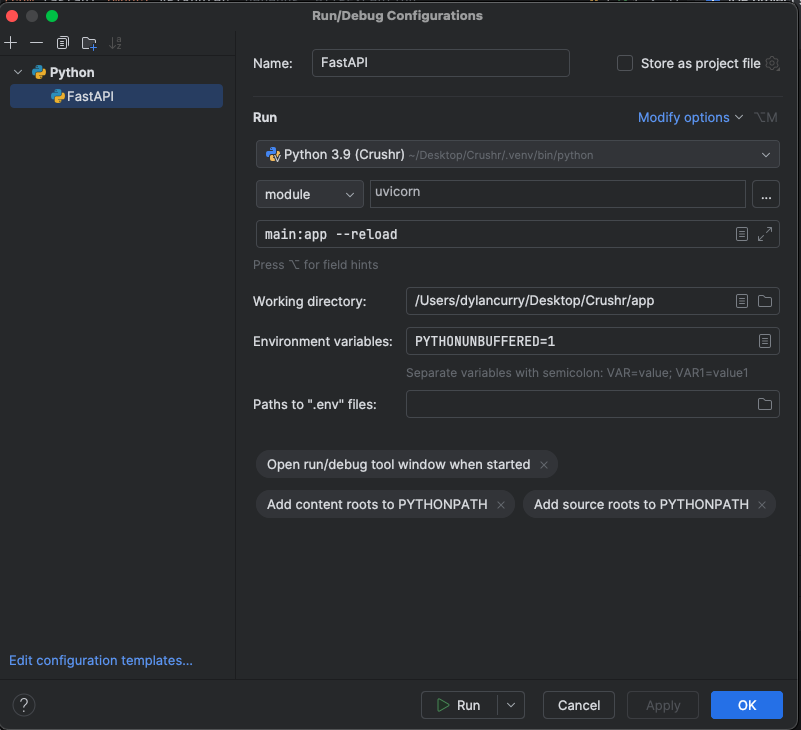

# Crushr
A customizable workout planning and training tool

# Running with Docker  
You can go to the crushr-infra repo (https://github.com/DMCurry/crushr-infra)  
and follow the instructions there. Other than that migrations will be the same  
(but it's crucial that you make a new dump file correctly after the migration)  
and seeding the db will be similar but both of these things will first require   
logging into the running Crushr back end container with `docker exec -it fastapi-backend sh`  
Also. If switching back from docker to running local/normally, you might need to switch  
the mysql DATABASE_URL in your `.env` file. 

# Project Local Setup

### 1. Create and Activate Virtual Environment
Open a shell and cd into the project directory.

`python -m venv venv`  
`source venv/bin/activate`  
or on windows `venv/Scripts/activate`

### 2. Install Dependencies
`pip install -r requirements.txt`

### 3. Install mysql and mysqlclient
On MacOS using homebrew: 
`brew install mysql pkg-config`  
`brew services start mysql`  
Then within active virtualenv shell:
`pip install mysqlclient`  
Then test sql shell with `mysql -u root`  
and create a database with: `mysql -u root -p -e "CREATE DATABASE database_name;"`

### 4. Create a .env file
SECRET_KEY= (Put some sort of secret key here for the JWT)  
ALGORITHM=HS256  
DATABASE_URL=mysql+mysqldb://root:@localhost:3306/database_name

### 5. Set up a run config or edit main.py 

Otherwise try adding `from dotenv import load_dotenv
`   to main.py and then directly below the imports add `load_dotenv()`  
to make sure that you can load the environment variables upon 
running the fastAPI application.

### 6. Running the application locally
If using pycharm simply run the config you created.  
Otherwise run `uvicorn main:app --reload` in the shell.

# Seeding the Database
### 1. Make sure DB is running
If it isn't then do `brew services start mysql`
### 2. Clear the DB
`mysql -u root mydb < dump.sql` to replace db with clean schema empty of data  
### 3. Make changes to the JSON seed files if desired
### 4. Seed the db
`python seed.py`  
Then verify the new data made it into the db

# Testing the routes
### 1. Head to swaggerUI after starting the application
http://127.0.0.1:8000/docs
### 2. Login
Make sure the test database is seeded.  
Send a request to the /login route first:
- Ex test creds: (username: beginner_user, password: abcd)
- The jwt should now be stored in the cookies and you can make  
subsequent requests to the endpoints that require getting this jwt from cookies.

# Handling Database Migrations
### 1. Create new revision
`alembic revision --autogenerate -m "revision name"`  
### 2. Check revision file
Under revisions dir make sure the new file is there.  
Make sure the `upgrade()` and `downgrade()` functions look correct.  
### 3. If everything looks good then run upgrade
`alembic upgrade head`
### 4. Log into running database
`mysql -u root`  
`use database_name`  
`show tables`  
`describe new_table_name`  
to verify that the structural changes to the model/table worked.  
### 5. Update database sql dump file
If everything checked out on the last step then you can update  
the dump file. But first make sure there is no data in the tables as we want to have the dump  
be only structural and not include test data. You can do this with `mysql -u root mydb < dump.sql`.  
Then verify the db is empty of data and create the dump with `mysqldump -u root database_name > dump.sql`.  
It's important to update this dump because if something happens then you can manually  
reset/clear the database with `mysql -u root mydb < dump.sql`.
